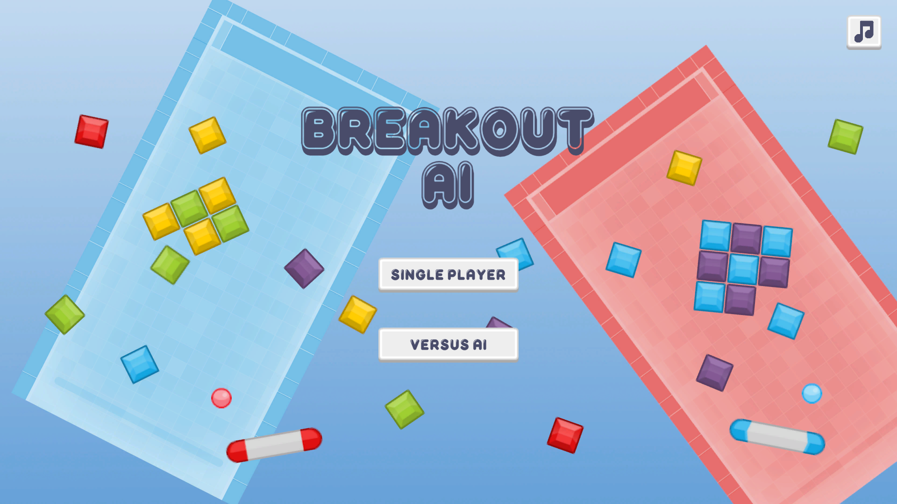
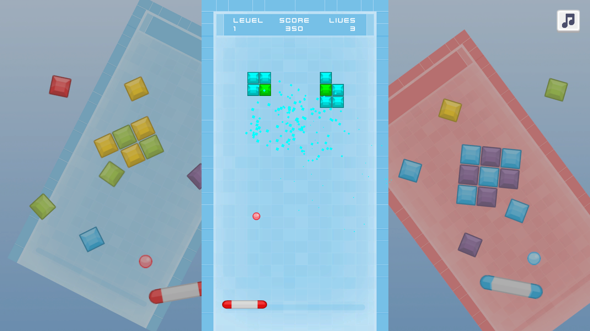
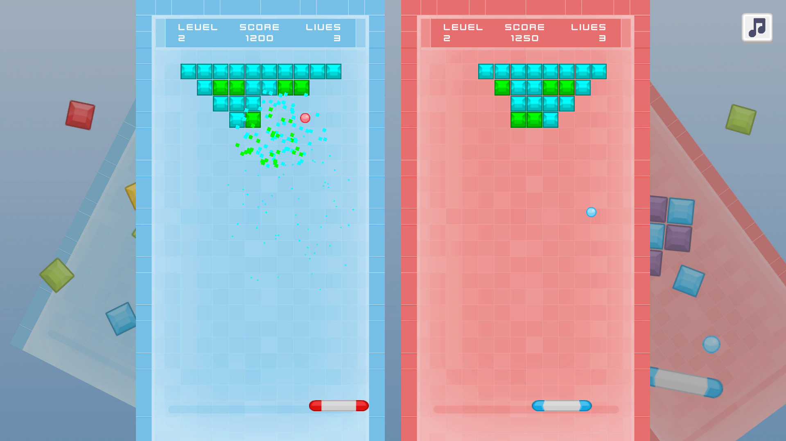
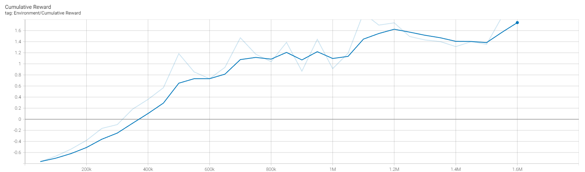
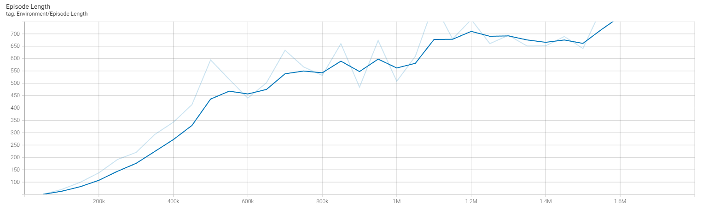

# Breakout AI

Experience the classic arcade game with a twist as you challenge an AI opponent powered by Unity's ML-Agents toolkit in this exciting Unity game project.

Check it out [here](https://play.unity.com/en/games/add8c938-9f99-4a6b-97f0-656f5bb21b9c/breakout-ai)!

## Features

- Single-player mode and versus mode against an AI opponent.
- 10 procedurally-generated levels.
- Scoring system to track and compare player performance.
- Immersive audio to enhance the gaming experience.

## AI Opponent Details

- Powered by Unity's ML-Agents toolkit.
- Trained for 1.5m steps via reinforcement and imitation learning (~4 hours of training with 10 concurrent training environments).

## Screenshots

### Main Menu

### Single-Player Mode

### Versus Mode

## TensorBoard Graphs

### Cumulative Reward

- X-axis: Number of training steps.
- Y-axis: Cumulative reward.

Positive rewards are given when the ML Agent destroys a brick, while negative rewards are given when the Agent loses a life. The above graph shows that rewards increase as training time increases, meaning that the Agent destroys bricks more often and/or loses lives less often.

### Episode Length

- X-axis: Number of training steps.
- Y-axis: Episode length.

The training episode ends when the ML Agent loses a life. The above graph shows that episode length increases as training time increases, meaning the Agent loses lives less often.

## Special Thanks

- [DamageSoftware](https://www.youtube.com/@DamageSoftware) for general guidance and assets.
- [Kenney](https://kenney.nl/) for image assets.
- [Abstraction](https://www.abstractionmusic.com/) for music assets.
- [Tim Beek](https://timbeek.itch.io/) for SFX assets.
- [Youssef Habchi](https://www.fontspace.com/youssef-habchi) for font assets.
